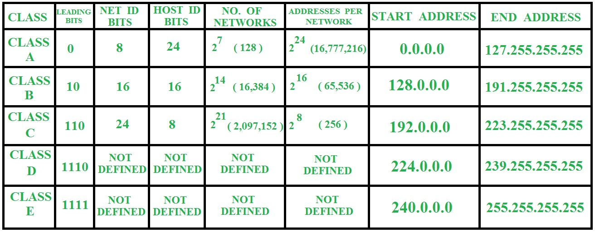

1. **What is an IP address?**
    IP addresses are unique identifiers assigned to devices on a network. They come in two versions, IPv4 and IPv6. IPv4 addresses are structured as four sets of numbers separated by periods, like 192.168.0.1. IPv6 addresses are longer and hexadecimal, like 2001:0db8:85a3:0000:0000:8a2e:0370:7334.

2. **What is Subnets?**
    This division helps in efficient utilization of IP addresses and also aids in controlling network traffic. When you're dealing with IP addresses, particularly in IPv4, you're working with a limited pool of addresses. Subnetting allows you to carve out smaller chunks of this pool for different parts of your network.

    
    In the above table No. of networks for class A should be 127. (Network ID with all 0 s is not considered)

3. **Refer this for IPv4:** [Tricks to Remember Five Classes of IPv4](https://medium.com/networks-security/tricks-to-remember-five-classes-of-ipv4-484c191678fb)

4. **Public subnet - Private Subnets:** Reserved for internal networks and not accessible directly from the internet. 

5. **Private subnet - Public Subnets:** Routable on the internet and have globally unique IP addresses.

6. **What is CIDR?**
    CIDR, or Classless Inter-Domain Routing, is a way to allocate IP addresses and IP routing more efficiently than the class-based system. It allows for more flexibility in defining the network portion and host portion of an IP address. With CIDR, you can specify any number of bits for the network portion, which means you can create subnets of any size.

    In CIDR notation, the IP address is followed by a forward slash and a number, which indicates the number of bits used for the network portion. For example:

    - 192.168.0.0/24 means the first 24 bits are used for the network, and the remaining bits are for hosts.
    - 10.0.0.0/16 means the first 16 bits are used for the network, and the remaining bits are for hosts.

7. **What is Subnet Masking?**
    A subnet mask is a 32-bit number that defines the network portion and host portion of an IP address. It helps devices determine whether an IP address is on the local network or on a remote network.

    The subnet mask consists of a series of '1' bits followed by a series of '0' bits. The '1' bits represent the network portion, and the '0' bits represent the host portion.

    For example, the subnet mask 255.255.255.0 in binary is 11111111.11111111.11111111.00000000. In this mask, the first 24 bits represent the network portion, and the last 8 bits represent the host portion.

8. **Relationship Between CIDR and Subnet Masking:**
    CIDR notation and subnet masking are closely related. In CIDR notation, the number following the forward slash (/) represents the number of '1' bits in the subnet mask.

    For example:

    - 192.168.0.0/24 means the subnet mask is 255.255.255.0, where the first 24 bits are '1' and the remaining 8 bits are '0'.
    - 10.0.0.0/16 means the subnet mask is 255.255.0.0, where the first 16 bits are '1' and the remaining 16 bits are '0'.
    Understanding CIDR notation allows you to specify the size of subnets more clearly and efficiently. It provides a standardized way to represent network configurations, making it easier to communicate and manage network addressing schemes.

9. **What are Ports?**
    Ports are virtual endpoints used for communication in networked systems. They allow different applications and services running on a single device to share the network connection. Ports are a fundamental part of the TCP/IP networking model and are crucial for enabling communication between computers over a network.

Here's a breakdown of ports:

 **I. Port Numbers:**
Ports are identified by numbers ranging from 0 to 65535. These numbers help direct network traffic to the appropriate application or service running on a device. Ports are divided into three ranges:

- **Well-Known Ports (0-1023):** These ports are reserved for system services and applications that are          considered standard. For example:
  - Port 80: HTTP (Hypertext Transfer Protocol) for web servers.
  - Port 443: HTTPS (HTTP Secure) for secure web communication.
  - Port 22: SSH (Secure Shell) for secure remote access.

- **Registered Ports (1024-49151):** These ports can be registered with the Internet Assigned Numbers Authority (IANA) for specific applications or services. They are commonly used by various applications and protocols but are not reserved.
  
- **Dynamic or Private Ports (49152-65535):** These ports can be used by any application on a first-come, first-served basis. They are often used for temporary purposes, such as client connections to servers.

 **II. TCP and UDP Ports:**
Ports are further categorized based on the transport layer protocol they use:

- **TCP (Transmission Control Protocol):** TCP ports are used for connection-oriented communication. TCP ensures that data sent from one device is received correctly by the other device. Examples of TCP-based applications include web browsing, email, and file transfer.
  
- **UDP (User Datagram Protocol):** UDP ports are used for connectionless communication. UDP is faster and more efficient than TCP but does not guarantee delivery or order of packets. Examples of UDP-based applications include DNS (Domain Name System) and video streaming.

 **III. Port Numbers in URLs:**
In URLs (Uniform Resource Locators), the port number can be specified after the hostname or IP address, separated by a colon. For example:
- `http://example.com:8080` specifies the use of port 8080 for HTTP communication.
- `ftp://ftp.example.com:21` specifies the use of port 21 for FTP (File Transfer Protocol) communication.

Understanding ports is essential for network administrators, developers, and anyone involved in networking or application development. Ports enable the efficient routing of network traffic and the functioning of various networked services and applications.
