**1. What is Terraform, and how does it differ from other infrastructure as code tools?**
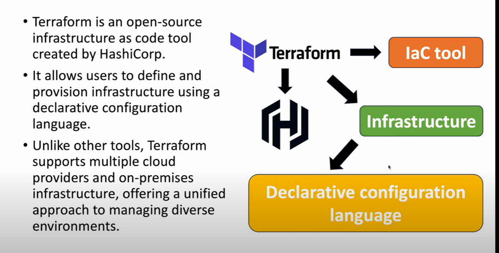

**2.Explain the concept of "declarative syntax" in Terraform and how it contributes to infrastructure management**
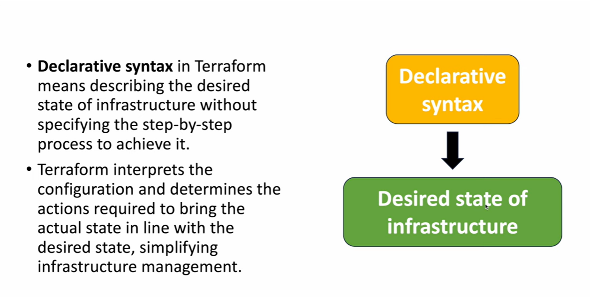

**3: What are the key components of a Terraform configuration file?**
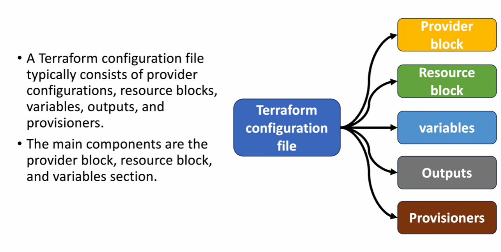

**4: How does Terraform maintain state, and why is state management important in infrastructure as code?**
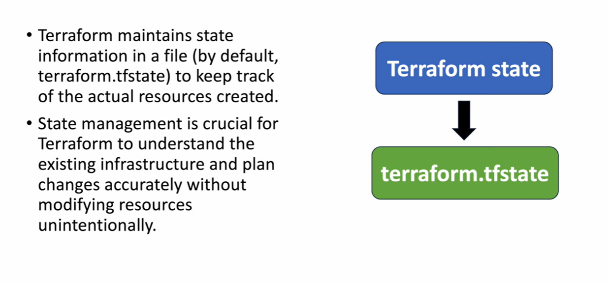

**5: Describe the process of initializing a Terraform project. What does the terraform init command do?**
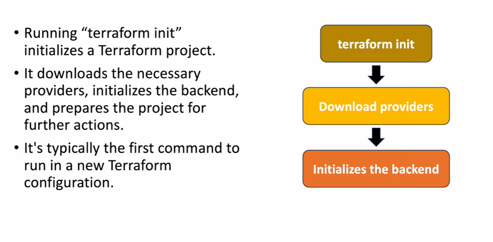

**6: What is a Terraform provider, and how does it facilitate interactions with different infrastructure platforms?**
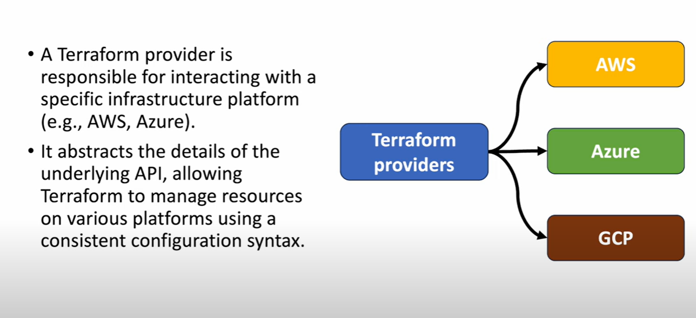

**7: Explain the purpose of the terraform plan command. What information does it provide, and why is it valuable?**
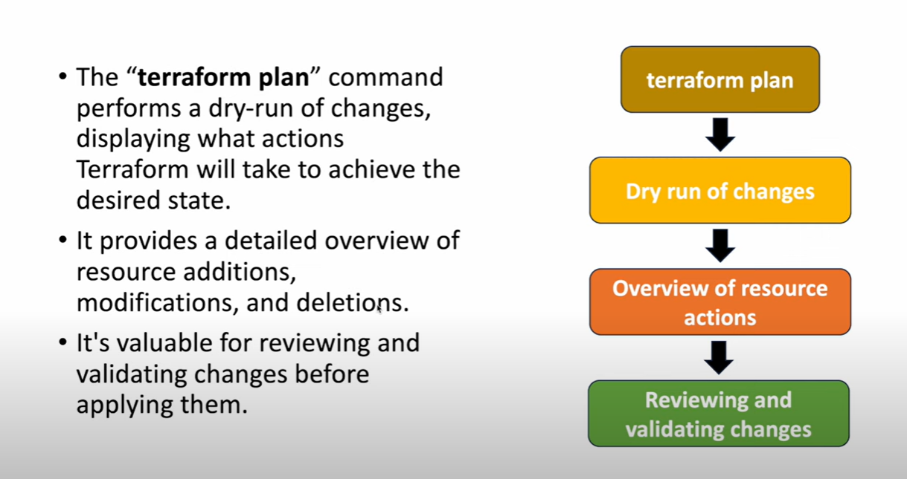

**8: How does Terraform handle dependencies between resources, and what is the significance of the Terraform graph?**
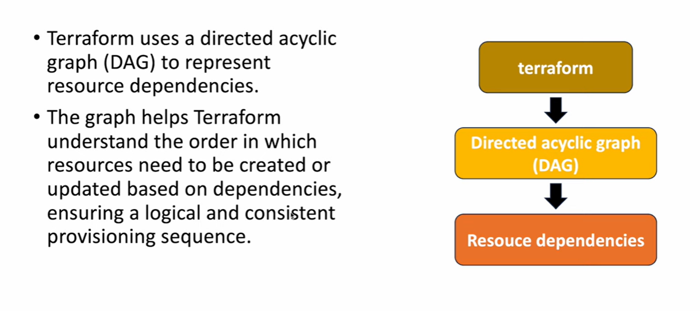

**9: What is the difference between Terraform's "provisioners" and "remote-exec" provisioner?**
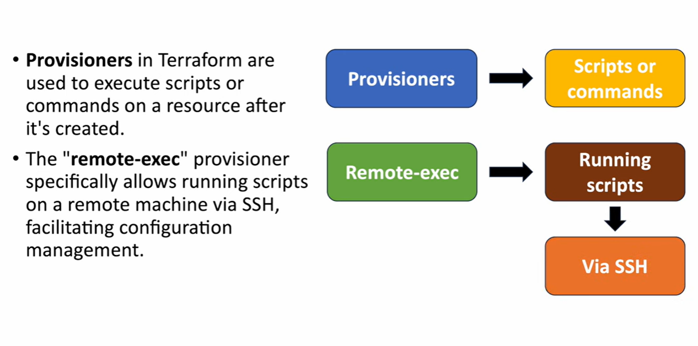
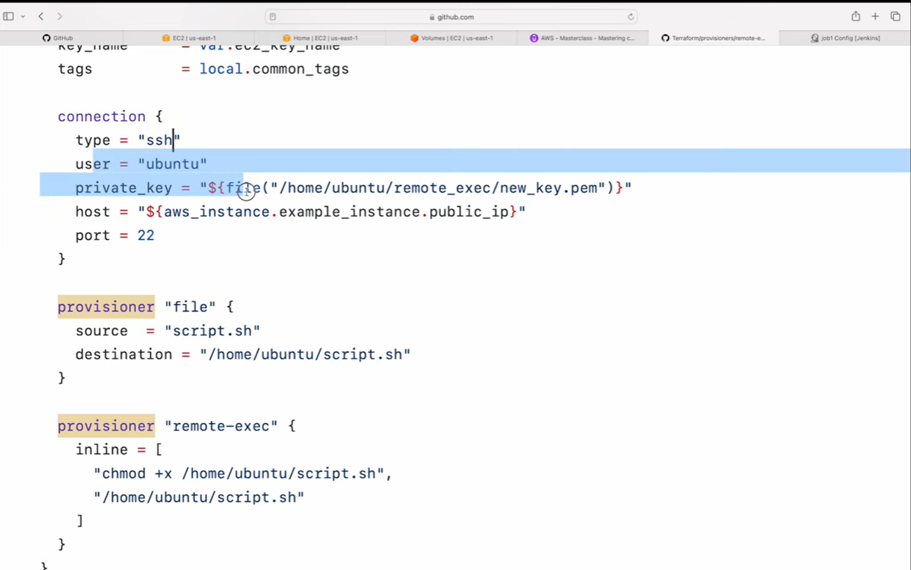

**10: How can you manage sensitive information, such as API keys, in Terraform configurations securely?**
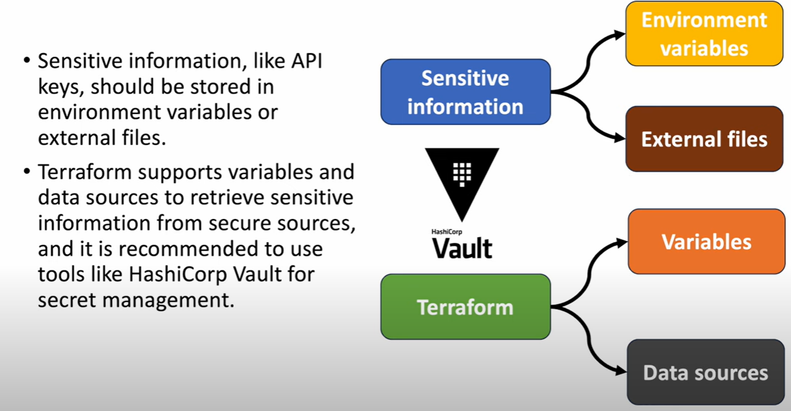

**11: What are Terraform workspaces, and how can they be useful in managing multiple environments or configurations?**
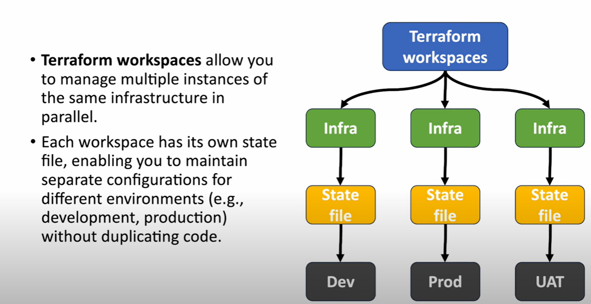

**12: Explain the concept of "Terraform modules" and how they contribute to code reusability and maintainability.**
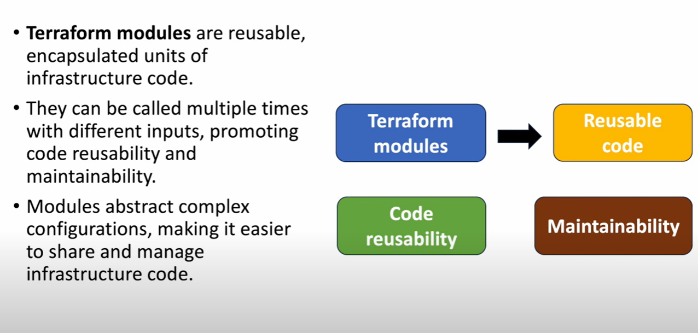

**13: How does Terraform handle updates or changes to existing infrastructure? What is the purpose of the terraform apply command?**
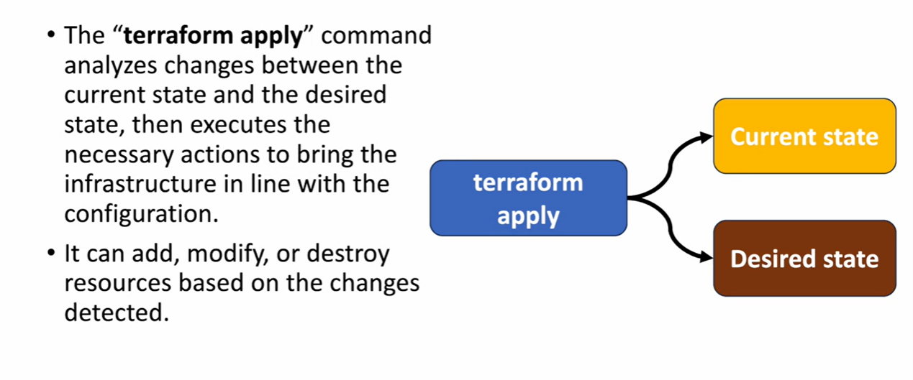

**14: What is the significance of Terraform providers' version constraints, and how can they be managed in a Terraform configuration?**
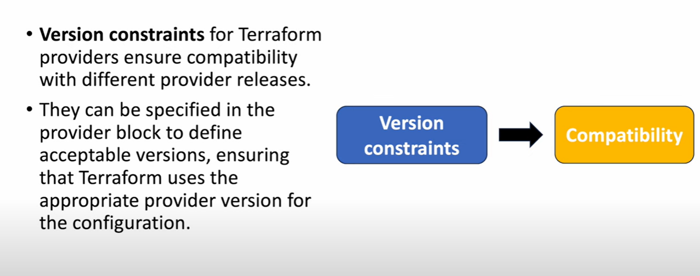

**15: Describe scenarios in which you might use Terraform "remote backends" and the advantages they bring to state management.**
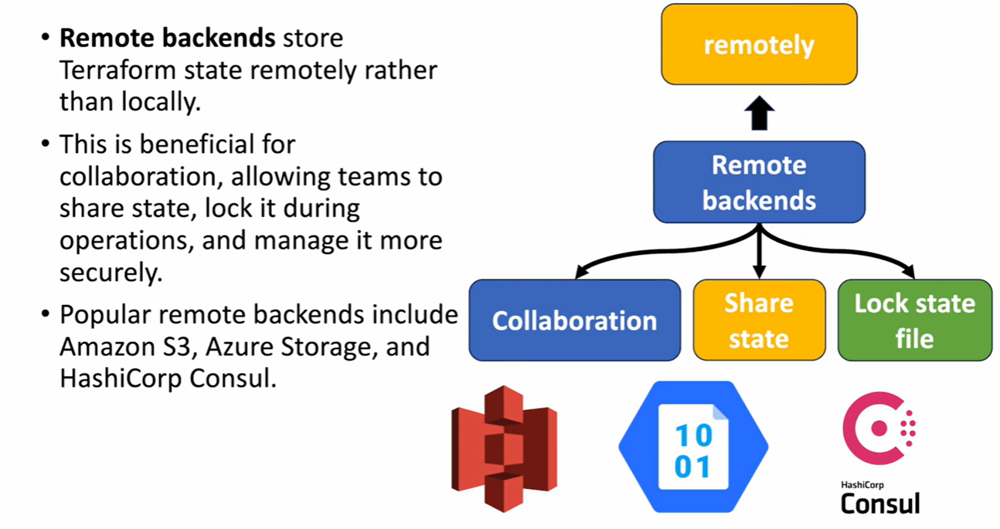